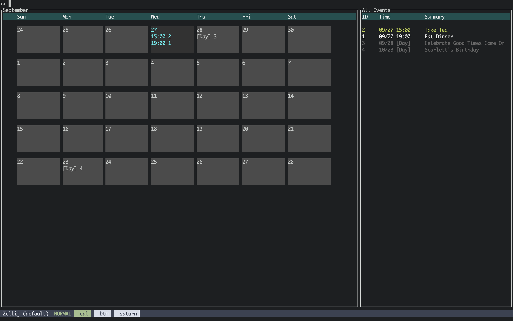
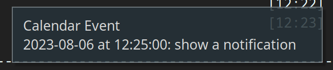

# saturn: a calendar for CLI nerds

**NOTE:** all docs here chase the `main` branch features. If you want docs for
a specific version, go to the `README` for the appropriate tag.

If you like the application, come to the issues list and voice your ideas and
concerns. I have personally been using `saturn` and `sui` for some time
alongside Google Calendar (for more complicated situations) with few issues
outside of things that happen when developing software normally.

Saturn provides you with a CLI interface to calendaring much in the way
[taskwarrior](https://github.com/GothenburgBitFactory/taskwarrior) does with
tasks. It also provides you with several methods to query and notify yourself
of important appointments. It can act standalone or integrate fully with Google Calendar.

[Here](https://asciinema.org/a/XkRCXcgucQCRYassutGLMlWqq) is a demo of it in action.

Saturn is also now providing a TUI as a separate program since release v0.2.0;
`sui` will present a calendar in a terminal window and allow you to interact
with it in similar ways to `saturn`. See below for the list of commands.

Here is what it looks like:



# Table of Contents

-   [Installation](#installation)
-   [Entry language](#entry-language)
    -   [Formats](#formats)
        -   [Dates](#dates)
        -   [Times](#times)
        -   [Durations](#durations)
-   [Querying](#querying)
    -   [Listing](#listing)
    -   [Notifying](#notifying)
    -   [Editing](#editing)
    -   [Deletion and Mutation](#deletion-and-mutation)
    -   [Search](#search)
-   [Database &amp; Configuration File](#database--configuration-file)
-   [Leveraging the well features with a periodic scheduler](#leveraging-the-well-features-with-a-periodic-scheduler)
-   [Recurring tasks](#recurring-tasks)
-   [Google Calendar Support](#google-calendar-support)
-   [TUI Commands](#tui-commands)
-   [Target Platform](#target-platform)
-   [Author](#author)

## Installation

Install with cargo:

```
cargo install saturn-cli
```

## Entry language

Entry language is basically:

```
ENTRY = [ "recur" <duration> ] <date> <AT | SCHEDULED | ALL DAY> ["notify" <duration>] <detail>
AT = at <time>
SCHEDULED = from <time> to <time>
ALL DAY = all day
```

You trigger it by using `saturn entry`:

```
saturn entry tomorrow at 8pm Take a Shower
```

This will schedule a shower tomorrow at 8pm with a notification at the time of
the appointment. You can also use `saturn e`.

### Formats

There are numerous formats that can be used for different times, dates, and
durations. Localization is desired but I haven't found a good set of tools for
doing it yet.

#### Dates

Dates can be represented a number of ways:

-   `today`, `tomorrow`, and `yesterday` are case-insensitive and have their
    traditional relative meanings.
-   A day (integer) by itself will assume the current month and year.
    -   You can also end the day number with traditional suffixes such as `th`, `st`, `nd`, etc.
-   `month/day` (e.g. 8/7) will assume the current year.
-   `year/month/day` (e.g. 2023/8/7) will represent a full date.
-   The following day names and abbreviations can be used. The current day, e.g.
    if today is Friday, will mean today. Otherwise, it means the next day in the
    following week with that name. The words are not case-sensitive.
    -   Sunday: "Sun"
    -   Monday: "Mon"
    -   Tuesday: "Tu", "Tue", "Tues"
    -   Wednesday: "Wed", "Weds"
    -   Thursday: "Th", "Thu", "Thurs"
    -   Friday: "Fr", Fri"
    -   Saturday: "Sat"
-   The following characters can be used as date separators: `/`, `-`, and `.`.

#### Times

-   `hour:minute:second` represents a full time. You may also use `.` for the separators.
-   `hour:minute` 24-hour time with the following exception: for today's date:
    when less than 13 represents the time in relationship to the current
    12-hour clock. 13 and above are 24-hour time. You can change this behavior
    with `saturn config set24h-time`.
-   `hour:minute[pm|am]` represents the current 12 hour time with appropriate time of day designation.
-   `hour[pm|am]` represents the top of the hour in 12 hour time with the appropriate time of day designation.
-   `hour` represents the top of the hour in 12 hour time with the current time of day designation.
-   `midnight` can be used to refer to `00:00` or `12:00am`
-   `noon` can be used to refer to `12:00` or `12:00pm`.

#### Durations

All duration rules take from the [fancy-duration](https://github.com/erikh/fancy-duration) crate.

Durations are combined in order of precedence with single character
designations for each unit. Example: `2h15m12s`, is "2 hours, 15 minutes, and
12 seconds".

-   `s`: seconds
-   `m`: minutes
-   `h`: hours
-   `d`: days
-   `w`: weeks
-   `m` (leading position only): months
-   `y`: years

## Querying

**NOTE**: For Google Calendar, all listings that are unbounded time-wise have a
current maximum bound of 30 days back, plus 30 days ahead. This is to ensure
we grab all the results if possible in a single fetch, as well as not destroy
your network each time you want to query this information for old or large
calendars. `saturn` is not currently capable of backing up your Google Calendar.

### Listing

```
saturn list [--all]
```

Will list the database for today, or if `--all` is passed, will list the entire
db. Note that `saturn today` and `saturn t`, and `saturn l` are synonyms for
`saturn list`.

```
saturn now [--well=<duration>]
```

Will list the items that need to be addressed immediately. To configure how
much of a time to wrap around what "now" means, use the `--well` option.
Durations are specified in
[fancy-duration](https://github.com/erikh/fancy-duration) format.

`saturn n` is an alias for `saturn now`.

### Notifying

```
saturn notify [--well=<duration>] [--timeout=<duration>]
```

Will display a notification to the screen for every item that must be addressed
immediately. `--well` is similar to `now`'s functionality, and `--timeout`
configures how long to keep the notification up on the screen.

This is what a notification looks like in `dunst`, which the notification
system for `i3`. GNOME, KDE, MacOS, etc will look different, but have the
same text.



### Editing

```
saturn edit [-r] <id>
```

Will run `$EDITOR` and fill it with a YAML file. When this file is edited, it
will change the database and the remote side, if necessary. Specify `-r` for
recurring task IDs.

### Deletion and Mutation

```
saturn delete <ids...>
```

Will delete a calendar record by ID, which is listed with the listing tools.
Pass `-r` to delete a recurring task.

```
saturn complete <id>
```

Will mark a task as "completed". Completed tasks get a visual notification and
are automatically excluded from listing without the `--all` flag.

Does not work with Google Calendar.

### Search

Search is only available on `main` branch, or v0.4.0+.

Search allows you to search by metadata using an English-like syntax similar to
`saturn entry`. You can initiate this search by using `saturn search` or
`saturn /` (a literal forward slash) followed by the metadata commands. In
`sui`, you can use `search` or `/` at the prompt with the same syntax.

In `sui`, search does not live update; you must execute the search command
again to see new results.

Times, Dates and Durations are all the same as mentioned earlier in this document.
Search terms can be combined to form more advanced queries; currently, the only
boolean operation is "AND", so for example two separate dates will result in no
results as nothing can match both. Boolean operations in search are a planned
feature.

The terms (and their parameters) follow:

-   `field`: field takes a required `key` parameter which is followed by the name
    of the key you want to search for. If a value is omitted, only presence of
    the key is required. To provide a value, specify `value`. Keys and values do
    not need to be presented in any specific order.
-   `date`: Specify a date to match. If the keyword `from` is provided in the
    first position instead of a date, you may specify a date range with the
    syntax `<start date> to <end date>`.
-   `time`: Specify a time to match. `from` works just like with `date`.
-   `detail`: This is the summary of your event, and is a substring,
    case-insensitive match. Regular expressions and other free-form text options
    will come eventually.
-   `recur`: This matches all tasks that belong to a specific recurring task,
    specified by ID. Use `show recur` in `sui` or `saturn list -r` to list
    recurring tasks.
-   `finished`: For tasks that support being marked completed, this only matches those.
-   `unfinished`: the inverse of `finished`.

As mentioned prior, search terms can be combined with boolean "AND", which is
implicit. Here are some examples of search terms you can use:

-   `saturn search date 10/23`: Find all calendar items that are on October 23rd
    of this year.
-   `saturn search date 10/23 time from 2pm to 10pm`: Find all calendar items
    that are on October 23rd and occur between 2 and 10pm.
-   `saturn search date 10/23 time from 2pm to 10pm detail Scarlett`: Find all
    calendar items that are on October 23rd and occur between 2 and 10pm and
    contain the word "Scarlett" in the item summary.
-   `saturn search date 10/23 time from 2pm to 10pm detail Scarlett unfinished`:
    Find all calendar items that are on October 23rd, occur between 2 and 10pm,
    contain the word "Scarlett" in the item summary and have not been completed.

To return to the full listing in `sui`, use one of the `show` commands, such as
`show all`.

Search will evolve over time and suggestions on how to improve it are welcome.

## Database & Configuration File

Saturn keeps a CBOR database in `~/.saturn.db`. Locking is flock(2), and quite
primitive. Suggestions and patches welcome.

The configuration file is only required in limited scenarios (such as remote
calendar support) and exists in `~/.saturn.conf`. It is a plain YAML file, but
is typically manipulated by `saturn config` commands, which may replace any
comments or other manipulations you previously did to the file by hand.

## Leveraging the well features with a periodic scheduler

The `--well` options take a duration. This duration is intended to roughly
match the frequency at which you run the program, so that there is little to no
overlap between event firings. This flag is provided for `saturn now` and
`saturn notify`.

Notifications (specified by a `notify` entry stanza) are only fired once in any
event. Events, on the other hand, are shown every time they fall into the
window, which is the current time, +/- the `--well` duration.

I hope this clears things up; I was trying to figure out a good way to run this
in `cron` etc without spamming myself with notifications for a long period of
time.

Here's an example: we run a loop of `saturn notify` with a well of two minutes,
and then we sleep for a minute. This allows notify to catch the alert only
once, passing it up by the next time it runs.

```bash
while true
do
    saturn notify --well 2m
    sleep 60
done
```

## Recurring tasks

Recurring tasks start their entry with the "recur" keyword and a duration.
Every time the program is run and touches the database, it will look to add
recurring tasks. Recurring tasks are based off the last task that was saved,
and every recurrence up to the current point will be added in the absence of
them. In the Unix file implementation, (not Google Calendar, which is
responsible for creating its own recurring events) until they are added, they
will not have IDs nor can they be manipulated. Commands like `now` and `notify`
which only perform read operations also adjust this data, so they can fire
notifications properly for new tasks.

## Google Calendar Support

Google Calendar support is working, with OAuth credentials being setup properly
and limited control of the calendar is possible within the realm of what saturn
currently supports. More is anticipated to be built atop this framework. Do not
be surprised if functionality is confusing or missing. Please put in issues
with your concerns, thanks!

`sui` also works beautifully with Google Calendar, providing a compelling, if
primitive replacement for the web UI.

To use `saturn` with Google Calendar, you must create a Google Cloud account
and assign an OAuth application to it. One is not provided automatically by
using `saturn` to eliminate concerns of data provenance.

To do this, follow [these
steps](https://developers.google.com/calendar/api/quickstart/go), which go into
how to set up an application for development. Be sure to setup any accounts you
want to use as "Test Users", and ensure that
`https://www.googleapis.com/auth/calendar` is in your list of allowed scopes.
Once you have the "Client ID" and "Client Secret", run this command:

```bash
saturn config set-client <client id> <client secret>
saturn config get-token
saturn config db-type google
```

The `get-token` command will have you access a URL in your browser and make you
login to the google account you wish to use, which must be listed in your
"testing users" in the OAuth setup above. As a final step, it will call back
into a web service the application starts, which will feed it the token.

Your token will expire if you do not use the tool regularly. Stuffing `saturn
notify` in cron will alleviate this a bit. To get a new key, use `saturn
config get-token` and follow the prompts. No other settings need to change.

Setting the db-type will change the source of data. If you were using a local
database and want to go back to it, `saturn config db-type unixfile`.

Notifications setup in Google Calendar are not honored yet. This will be
resolved soon!

Other things we want to do that aren't here yet:

-   Fields (URLs, Locations, etc)
-   Attendees

## TUI Commands

The TUI accepts several commands at the prompt; this command-set will grow with time. To interact with it, just type and hit enter to send a command.

-   `e` or `entry`: Process an entry in `saturn entry` format.
-   `d` or `delete`: Delete all the IDs provided (separate them with spaces). `d recur` or `delete recur` to delete recurring items.
-   `show today` will show today's calendar items, where `show all` will show the entire calendar (the default).
-   `show recur` will show you recurring tasks.
-   `show <id>` will show you more information about that particular task. Use `show recur <id>` to show a recurring id.
-   `edit <id>` will raise an editor to edit your item's properties. `edit recur <id>` will edit a recurring item.
-   `quit` will exit the program.

## Target Platform

Due to flock(2) use, which to the best of my knowledge is the only reason,
Windows probably does not work properly. Patches welcome if there are windows
users who'd like to use it.

## Author

Erik Hollensbe <git@hollensbe.org>
